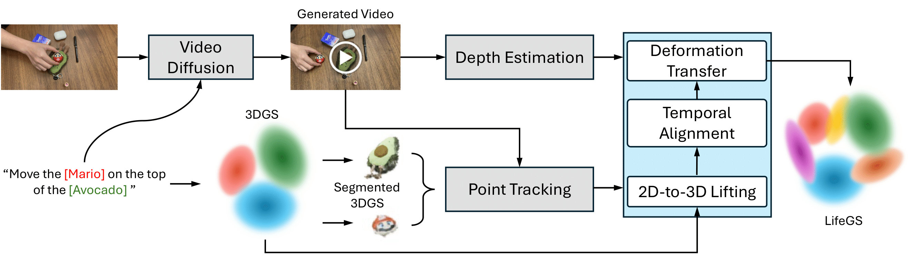
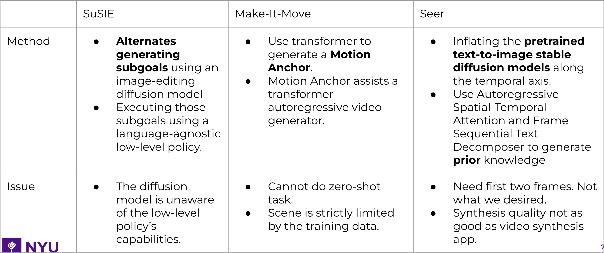

# Animate3DGS
<b>CV24 Fall Final Project</b>

This is the implementation of our project: [Bringing Static 3D Scenes to Life: Language-Guided Video Diffusion for Dynamic 4D Generation](https://github.com/Louis-Leee/Animate3DGS/images/CV_24FALL_Final_Project.pdf)

The overall pipeline is as follows:
<div align=center>

</div>

Basically, we have the following 3 stages in this pipeline:

- A. [Language-embedded 3DGS segmentation](#stage-a-language-embedded-3dgs-segmentation)
- B. [Motion Video Generation for Trajectory Design](#stage-b-motion-video-generation-for-trajectory-design)
- C. [Depth Estimation on Generated Motion Video](#stage-c-depth-estimation-on-generated-motion-video)

The detailed implementation guide for each stage is provided below.

<a id="stagea-section"></a>
## Stage A: Language-embedded 3DGS segmentation
We imeplement 3DGS segmentation with reference to the official implementation of [SAGA (Segment Any 3D GAussians)](https://arxiv.org/abs/2312.00860).
Please refer to [project page](https://jumpat.github.io/SAGA/) for more information. 
<!-- <br> -->

### Installation
The installation of SAGA is similar to [3D Gaussian Splatting](https://github.com/graphdeco-inria/gaussian-splatting).
```bash
git clone git@github.com:Jumpat/SegAnyGAussians.git
```
or
```bash
git clone https://github.com/Jumpat/SegAnyGAussians.git
```
Then install the dependencies:
```bash
conda env create --file environment.yml
conda activate gaussian_splatting
```
In default, we use the public ViT-H model for SAM. You can download the pre-trained model from [here](https://dl.fbaipublicfiles.com/segment_anything/sam_vit_h_4b8939.pth) and put it under ./third_party/segment-anything/sam_ckpt.

### Prepare Data

The used datasets are [360_v2](https://jonbarron.info/mipnerf360/), [nerf_llff_data](https://drive.google.com/drive/folders/14boI-o5hGO9srnWaaogTU5_ji7wkX2S7) and [LERF](https://drive.google.com/drive/folders/1vh0mSl7v29yaGsxleadcj-LCZOE_WEWB?usp=sharing).

The data structure of SAGA is shown as follows:
```
./data
    /360_v2
        /garden
            /images
            /images_2
            /images_4
            /images_8
            /sparse
            /features
            /sam_masks
            /mask_scales
        ...
    /nerf_llff_data
        /fern
            /images
            /poses_bounds.npy
            /sparse
            /features
            /sam_masks
            /mask_scales
        /horns
            ...
        ...
    /lerf_data
        ...
```
Since we need the pre-trained 3D-GS model for mask scales extraction, the first step is to train the 3D Gaussians:

### Pre-train the 3D Gaussians
We inherit all attributes from 3DGS, more information about training the Gaussians can be found in their repo.
```bash
python train_scene.py -s <path to COLMAP or NeRF Synthetic dataset>
```

### Prepare data
Then, to get the sam_masks and corresponding mask scales, run the following command:
```bash
python extract_segment_everything_masks.py --image_root <path to the scene data> --sam_checkpoint_path <path to the pre-trained SAM model> --downsample <1/2/4/8>
python get_scale.py --image_root <path to the scene data> --model_path <path to the pre-trained 3DGS model>
```
Note that sometimes the downsample is essential due to the limited GPU memory.

If you want to try the open-vocabulary segmentation, extract the CLIP features first:
```bash
python get_clip_features.py --image_root <path to the scene data>
```

### Train 3D Gaussian Affinity Features
```bash
python train_contrastive_feature.py -m <path to the pre-trained 3DGS model> --iterations 10000 --num_sampled_rays 1000
```

### 3D Segmentation
Currently SAGA provides an interactive GUI (saga_gui.py) implemented with dearpygui and a jupyter-notebook (prompt_segmenting.ipynb). To run the GUI:
```bash
python saga_gui.py --model_path <path to the pre-trained 3DGS model>
```
Temporarily, open-vocabulary segmentation is only implemented in the jupyter notebook. Please refer to prompt_segmenting.ipynb for detailed instructions.

### Rendering
After saving segmentation results in the interactive GUI or running the scripts in prompt_segmenting.ipynb, the bitmap of the Gaussians will be saved in ``./segmentation_res/your_name.pt`` (you can set the name by yourself). To render the segmentation results on training views (get the segmented object by removing the background), run the following command:
```bash
python render.py -m <path to the pre-trained 3DGS model> --precomputed_mask <path to the segmentation results> --target scene --segment
```

To get the 2D rendered masks, run the following command:
```bash
python render.py -m <path to the pre-trained 3DGS model> --precomputed_mask <path to the segmentation results> --target seg
```

You can also render the pre-trained 3DGS model without segmentation:
```bash
python render.py -m <path to the pre-trained 3DGS model> --target scene
```

<a id="stageb-section"></a>
## Stage B: Motion Video Generation for Trajectory Design
We explored three methods that are optimized for generating moving objects video specifically. The results are the following.
<div align=center>

</div>

All of them have the same issue, weak capability of doing zero-shot tasks. Eventually, we decided to use the commercial diffusional model based video generation model, [Runway AI]( https://runwayml.com/) and [KLing AI](https://klingai.com/). 

Both of them are able to achieve exactly equivalently well results. The only difference is that Runway AI is significantly faster than KLing AI for the same task, usually 10 seconds vs 10 minutes. So Runway AI is preferred. 
There are several important tips for this stage.

- Use two images as inputs instead of only one images, using the images of the initial position and the ending position as the first and last frames.
- The condition provided must follow the rules in the physics worlds.
- The prompt format should follow ”object+action” instead of "action+subject".

<a id="stagec-section"></a>
## Stage C: Depth Estimation on Generated Motion Video
To generate these depth maps, we leverage state-of-the-art monocular depth estimation models, such as [MiDaS](https://arxiv.org/abs/1907.01341), [DPT](https://arxiv.org/abs/2103.13413), or [Depth Any Video](https://arxiv.org/abs/2410.10815).

Please refer to [project page](https://github.com/Nightmare-n/DepthAnyVideo) for more information. 

### Installation

Setting up the environment with conda. With support for the app.

```bash
git clone https://github.com/Nightmare-n/DepthAnyVideo
cd DepthAnyVideo

# create env using conda
conda create -n dav python==3.10
conda activate dav
pip install -r requirements.txt
pip install gradio
```

### Inference
- To run inference on an image, use the following command:
```bash
python run_infer.py --data_path ./demos/arch_2.jpg --output_dir ./outputs/ --max_resolution 2048
```

- To run inference on a video, use the following command:
```bash
python run_infer.py --data_path ./demos/wooly_mammoth.mp4 --output_dir ./outputs/ --max_resolution 960
```

### Acknowledgement
The implementation of 3dgs segmentation refers to [SAGA (Segment Any 3D GAussians)](https://jumpat.github.io/SAGA/), [GARField](https://github.com/chungmin99/garfield.git), [OmniSeg3D](https://github.com/OceanYing/OmniSeg3D-GS), [Gaussian Splatting](https://github.com/graphdeco-inria/gaussian-splatting).

The implementation of video diffusion refers to [Runway AI]( https://runwayml.com/) and [KLing AI](https://klingai.com/).

The implementation of depth map generation refers to [MiDaS](https://github.com/isl-org/MiDaS), [DPT](https://github.com/isl-org/DPT), and [Depth Any Video](https://github.com/Nightmare-n/DepthAnyVideo).
We sincerely thank them for their contributions to the community.